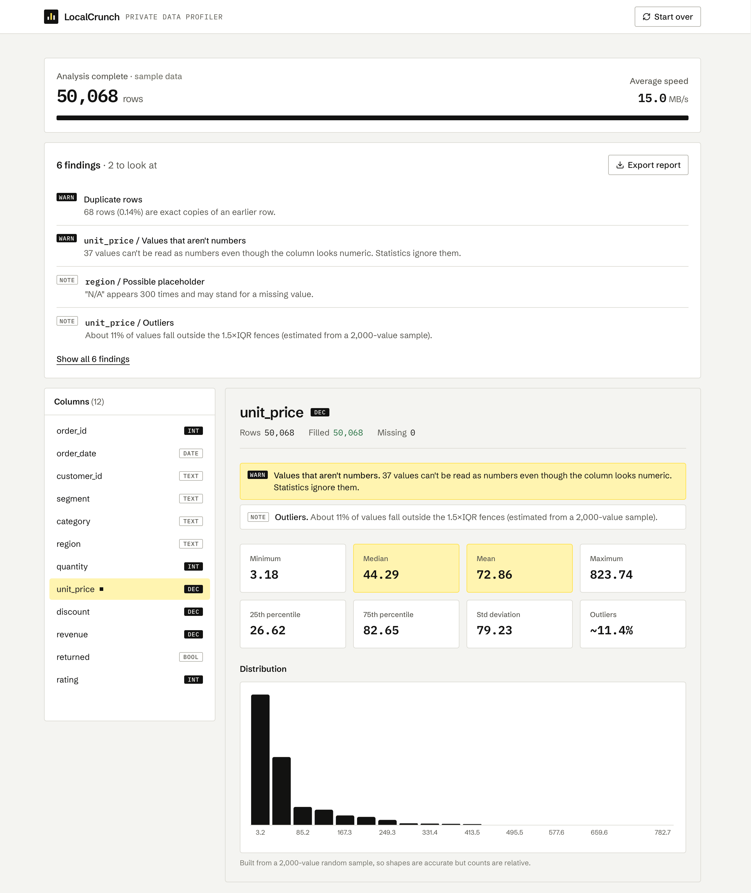
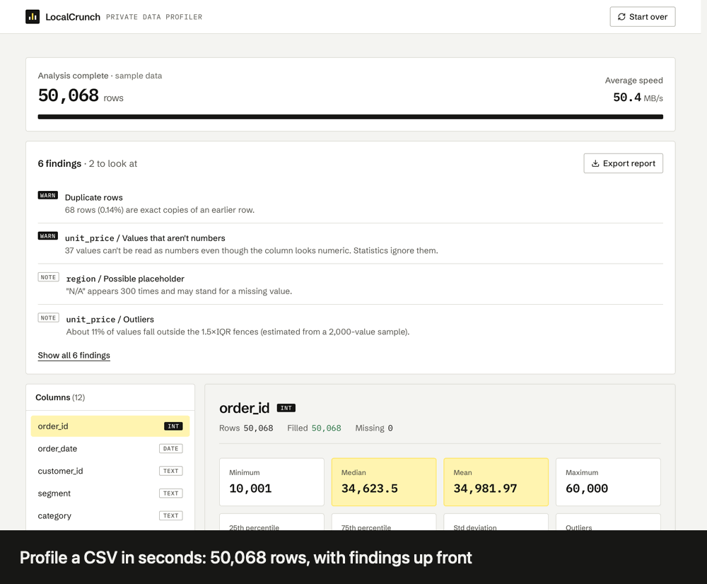

# LocalCrunch

**Live demo: [localcrunch.vercel.app](https://localcrunch.vercel.app)** (click "Try it with sample data", no file needed)



A private, instant data profiler and explorer that runs in your browser. Drop in a CSV and see what's in it: column types, distributions, missing values, duplicates and data-quality problems. Then click through the data to explore it. A Rust engine compiled to WebAssembly streams the file through a web worker in 10 MB chunks, so the file never leaves your machine and its size is limited by time, not memory.

The site has a landing page (`/`) and the tool itself (`/analyze`). Try it without a file: "Try it with sample data" opens the tool on a generated, deliberately messy 50,000-row orders dataset (`lib/sample-data.ts`) with missing values, placeholders, bad prices and duplicate rows for the profiler to find.

## What it does

**Profile**
- **Schema detection** from a 1 MB preview: int, float, date (`YYYY-MM-DD`), bool, text.
- **Per-column statistics**: min, max, mean, standard deviation (Welford's algorithm, single pass and numerically stable), median and quartiles, missing counts.
- **Distributions**: histograms and outlier estimates (1.5×IQR rule) from a 2,000-value reservoir sample.
- **Top values** with a capped frequency map, so high-cardinality columns can't blow up memory.
- **Data-quality findings**: exact duplicate rows, values that aren't valid numbers in a numeric column, mostly-empty columns, placeholders like `N/A`, constant columns, likely IDs and outliers.
- **Export** the findings and column stats as a Markdown report.

**Explore**
- **Row filters** (`contains`, `==`, `!=`, `>`, `>=`, `<`, `<=`, ANDed together) applied inside the Rust engine before any statistics are computed. Comparisons are numeric when both sides parse as numbers, lexicographic otherwise.
- **Click to filter**: press "Only this" on any top value to re-run the whole profile on just those rows, and remove filters from the chips above the results.



## How it fits together

```
File ──slice 10 MB──▶ main thread ──postMessage(ArrayBuffer)──▶ Web Worker
                                                                   │
                                                          cruncher_core (Rust/WASM)
                                                          csv parse → filters → stats
                                                                   │
              UI (Next.js, Recharts) ◀── throttled (300 ms) results ┘
```

Chunks rarely end on a record boundary, so the engine keeps an incomplete tail and prepends it to the next chunk. Newlines inside quoted fields don't count as record boundaries, and a final row with no trailing newline is flushed when the stream ends. Duplicate rows are detected by keeping a 64-bit fingerprint of each row (up to 2 million, about 16 MB), not the rows themselves.

## Run it

Requires Node and [pnpm](https://pnpm.io). The compiled engine (`cruncher_core/pkg`) is committed, so you don't need Rust to run or deploy the app.

```bash
pnpm install
pnpm dev          # http://localhost:3000
pnpm build        # production build (webpack, see below)
```

To change the Rust engine you also need Rust and [wasm-pack](https://rustwasm.github.io/wasm-pack/). Rebuild the package after every change and commit the result:

```bash
pnpm build:wasm
```

Both `dev` and `build` run webpack rather than Next's default Turbopack. The WASM is loaded inside a web worker, and Turbopack's output for that fails at runtime with a fetch error, while webpack's works.

## Tests

The engine has unit tests for type inference, Welford's statistics, quartiles and outliers, duplicate detection, chunk-boundary handling (mid-row, mid-quoted-field, missing trailing newline, CRLF), and every filter operator:

```bash
pnpm test:wasm
```

## Known limits

- CSV only (comma-separated). No JSON, TSV, Excel or Parquet yet.
- The first row is always treated as the header.
- Column types come from the first 1 MB. A later value that doesn't fit is still counted, and shows up as a finding for numeric columns.
- Medians, quartiles, outlier rates and histograms come from a sample, so they are estimates on large files. Min, max, mean and counts are exact.
- Above 1,000 distinct values a column is marked high-cardinality and only the first 1,000 seen are tracked, so its top-value counts are a lower bound.
- Beyond 2 million distinct rows, the duplicate count is a lower bound.
- Dates are recognized only as `YYYY-MM-DD`, and get no statistics beyond type detection and top values.
